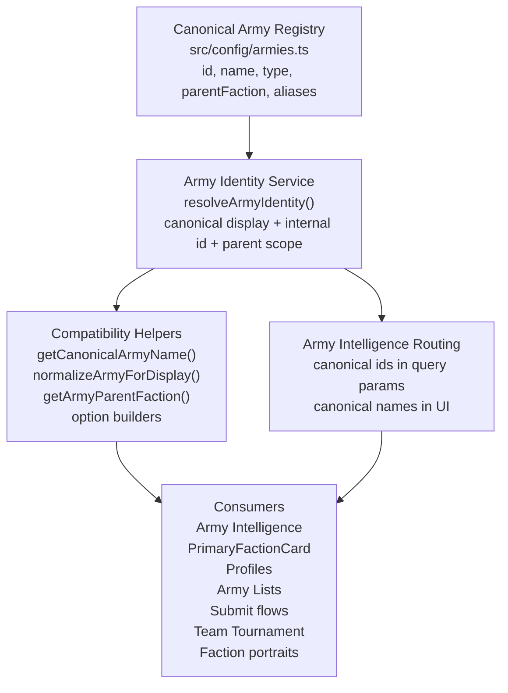

# Army Identity

Army Identity is the portal boundary for faction and sectorial resolution.

Features should resolve army values through `resolveArmyIdentity()` in `src/services/armyIdentity.ts` instead of normalizing display names, slugs, decoder output, or legacy aliases locally.

Rules:

- The registry owns available factions, sectorials, parent factions, and aliases.
- `resolveArmyIdentity()` accepts registry ids, display names, slugs, decoder values, and legacy aliases.
- Callers use `identity.id` for internal routing and filtering where an identifier is needed.
- Callers use `identity.displayName` for presentation.
- Feature code must not introduce local army normalization tables or resolver functions.
